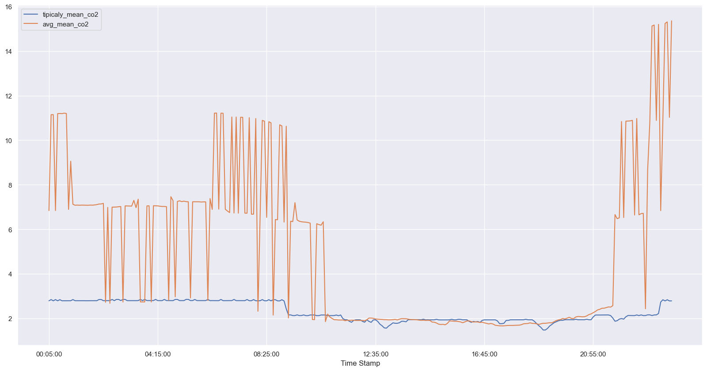
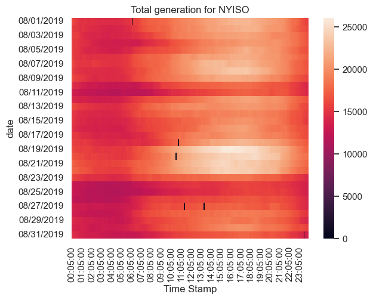

## Home assignment

***Model 3 - NYISO Fuel Mix Data Analysis***

**Introduction**

The goal of this assignment was to code a model that meets the Overall System Requirements and uses the following inputs:
* NYISO fuel-mix generation data for the month of August 2019 (see attached zip file) where the NYISO measures and reports (at 5 minute granularity) fuel-mix generation data for the entire ISO. This data separates electrical generation by the following fuel sources: dual fuel, natural gas, nuclear, other fossil fuels, other renewables, wind, and hydropower. In this home assignment you ought to analyze and gather insights from the NYISO fuel-mix generation data. Note that all data is reported in time-ending format. For example, data at timestamp 12/15/2020 00:10:00 is for the timespan 12/15/2020 00:05:00 to 12/15/2020 00:10:00.
* Each of the fuel sources has a corresponding emission factor [metric kgCO2e/kWh] as difined below:
  - Dual Fuel = 0.444
  - Natural Gas = 0.426
  - Nuclear = 0
  - Other Fossil Fuels = 0.935
  - Other Renewables = 0.256
  - Wind=0
  - Hydro = 0

* Average day NYISO total generation for the given dataset, which shall be calculated by taking the average across each
timestamp for each day within the dataset
* Typical day NYISO total generation (the day that best matches the calculated average day)
* Equivalent carbon emissions (CO2e) associated with the NYISO fuel-mix generation for
the average and typical days

**Libraries**

* import pandas as pd
* import os
* import seaborn as sns
* import matplotlib.pyplot as plt

**Calculation of typical day**

Considering that the typical day was defined only as the day that best matches the calculated average day, the following process was defined, which calculates the difference between the observed data and the calculated average as an absolute value:

    def process_similarity(row) -> any:
    row["similarity_co2"] = abs(row["mean_co2"]["self"] - row["mean_co2"]["other"])
    row["similarity_mw"] = abs(row["mean_mw"]["self"] - row["mean_mw"]["other"])
    return row
    
 Thereafter, in order to find the day with the minimal lambda distance (to minimize disimilarities) from the list created by the aforementioned process, the following code is used:
 
    'similarity_index = similarity.index(min(similarity))'
 

**Results** 

As per requested as a part the assignment, the following tables have been created: 

* One (1) line plot of total generation for NYISO for the average and typical days (x-axis: timestamp, y-axis: generation). Impose both lines on the same plot.

The average day is displayed in orange and the blue represents the typical day. Notice that the energy generation is closely dependent on the working hours of the day. I suspect that is due to both labor availability and also in the cases of renewables -  outside environmental conditions. The peak output hours observed are between 2 and 6pm. 

* One (1) line plot of total carbon emissions for NYISO for the average and typical days (x-axis: timestamp, y-axis: total emissions). Impose both lines on the same plot.

The Average is displayed in orange and the blue represents the typical day. Notice that the average displays irregularities, especially prior and post- working hours. 

* Heatmap plot of total generation for NYISO (x-axis: date, y-axis: time of the day, z-axis: power) for the dataset (1 plot)

Due to noise in the data, some of the time stamps have been removed which are represented by the black spots in the graph (representing zeros). This noise constituted false time recording e.g. 00:12 min. This may be a measuring or reporting error. If it were to be included, the time stamp could be corrected into turning it into the closest 5 min interval rounding up or rather replacing it with the average in between the two time stamps where it is located. For the sake of transparency of these issues I decided to leave these problematic observations out of the sample for now.

Furthermore, from a labor perspective, it would be interesting to look at why there are distinctive productivity changes. For instance, the output drops severally over the weekends, especially those of 10, 11 as well as 24 and 25 of August. 

**Suggestions and future improvements**

In this assignment, I have not been trying the answer the reason why the data is behaving the way it is. I have not imposed any presuppositions. Hence, I am currently only able to display the curve that the production of energy follows and which days of the month have generated most/least amount of energy. However, in the future we might want to look at some of the causality or correlations of the data provided and include external factors which might be impacting our data. 

Furthermore, in order to answer more questions regarding the data, one should know the potential usage of this information. For instance, if a company is trying to understand the labor productivity of the energy production, paying closer attention to those particular aspects of the data and findings if highly benefitial when analyzing and presenting the output. Adversely, if one is interested in understanding how the weather conditions impact renewable energy production- those aspects is what should be further explored. However, without a proper reason why this data is to be analyzed, it is difficult to present the data in a way that is the most efficient and useful to the client.

For instance, were we to apply this to the the remainder of the year 2019, further considerations ought to be taken in place. To show you what I mean, we could assume that the time of year affects severally the weather conditions which in turn affect the Wind and Hydro production outputs for instance. Likewise, when not only looking at this data but analyzing it using e.g. econometric models, we could include factors such as rainfall and windspeed as some of the explanatory independent variables. Further, we could also account for the constraints related to the productivity of distinct labor hours.
